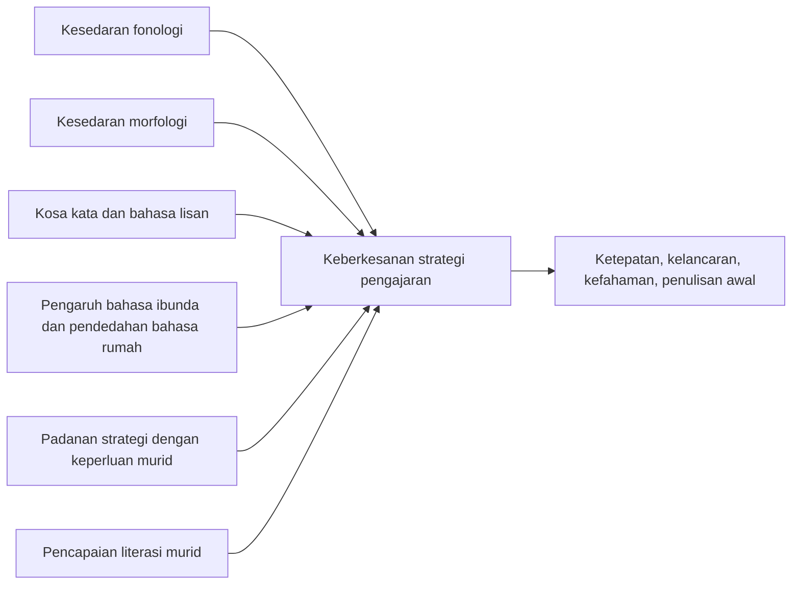

# Kerangka Konsep dan Cadangan Reka Bentuk Kajian

## 1. Cadangan fokus kajian

Cadangan fokus terbaik untuk topik ini ialah menilai sama ada faktor linguistik murid mempunyai hubungan yang signifikan dengan keberkesanan strategi pengajaran literasi Bahasa Melayu dalam kalangan murid Tahap 1.

## 2. Cadangan objektif kajian

1. Mengenal pasti faktor linguistik utama yang mempengaruhi literasi Bahasa Melayu murid Tahap 1.
2. Mengenal pasti strategi pengajaran literasi Bahasa Melayu yang digunakan oleh guru.
3. Menentukan hubungan antara faktor linguistik murid dengan keberkesanan strategi pengajaran.
4. Meneroka strategi yang paling sesuai bagi profil linguistik murid yang berbeza.

## 3. Cadangan persoalan kajian

1. Apakah faktor linguistik utama yang mempengaruhi penguasaan literasi Bahasa Melayu murid Tahap 1?
2. Apakah strategi pengajaran literasi Bahasa Melayu yang paling kerap digunakan oleh guru?
3. Adakah terdapat hubungan yang signifikan antara faktor linguistik murid dengan keberkesanan strategi pengajaran?
4. Bagaimanakah guru menyesuaikan strategi pengajaran mengikut keperluan linguistik murid?

## 4. Cadangan hipotesis

Jika kajian ini dijalankan secara kuantitatif atau kaedah campuran, hipotesis berikut sesuai digunakan:

- `H1`: Terdapat hubungan yang signifikan antara kesedaran fonologi murid dengan keberkesanan strategi pengajaran literasi Bahasa Melayu.
- `H2`: Terdapat hubungan yang signifikan antara kesedaran morfologi murid dengan keberkesanan strategi pengajaran literasi Bahasa Melayu.
- `H3`: Terdapat hubungan yang signifikan antara tahap kosa kata dan bahasa lisan murid dengan keberkesanan strategi pengajaran literasi Bahasa Melayu.
- `H4`: Terdapat hubungan yang signifikan antara pengaruh bahasa ibunda atau pendedahan bahasa rumah dengan keberkesanan strategi pengajaran literasi Bahasa Melayu.
- `H5`: Strategi pengajaran yang dipadankan dengan profil linguistik murid memberi kesan yang lebih tinggi terhadap pencapaian literasi berbanding strategi umum yang tidak dipadankan.

## 5. Cadangan pemboleh ubah

### Pemboleh ubah bebas

- kesedaran fonologi
- kesedaran morfologi
- kosa kata dan bahasa lisan
- pengaruh bahasa ibunda
- pendedahan Bahasa Melayu di rumah dan persekitaran

### Pemboleh ubah bersandar

- keberkesanan strategi pengajaran literasi Bahasa Melayu

### Cadangan indikator keberkesanan

- ketepatan bacaan
- kelancaran bacaan
- kefahaman bacaan
- kebolehan membaca kata berimbuhan
- kebolehan menulis perkataan atau ayat mudah
- penglibatan dan minat murid

### Pemboleh ubah moderator atau kawalan yang sesuai

- jenis sekolah
- lokasi sekolah
- pengalaman guru
- kekerapan intervensi
- tahap penguasaan awal murid

## 6. Cadangan model konseptual

Jika mahu model yang lebih kuat secara teori, gunakan struktur berikut:

- faktor linguistik sebagai pemboleh ubah bebas
- padanan strategi pengajaran sebagai mediator
- hasil literasi sebagai pemboleh ubah bersandar

Dalam bentuk yang lebih halus, keberkesanan strategi bukan hanya "hasil akhir", tetapi fungsi kepada padanan antara strategi dengan faktor linguistik murid.

## 7. Cadangan kerangka hujah

Kerangka hujah yang paling kukuh untuk proposal ini ialah:

1. Literasi awal Bahasa Melayu memerlukan penguasaan bunyi, suku kata, perkataan, morfologi, kosa kata dan kefahaman.
2. Murid Tahap 1 tidak datang dengan profil linguistik yang sama.
3. Oleh itu, strategi pengajaran yang standard tanpa penyesuaian tidak akan memberi kesan yang sama kepada semua murid.
4. Semakin tepat strategi dipadankan dengan profil linguistik murid, semakin tinggi keberkesanannya.

## 8. Cadangan instrumen

### Untuk faktor linguistik murid

- ujian kesedaran fonologi
- ujian membaca perkataan dan suku kata
- ujian kata berimbuhan atau kesedaran morfologi asas
- senarai semak kosa kata asas
- soal selidik latar belakang bahasa rumah

### Untuk strategi pengajaran guru

- soal selidik guru
- borang pemerhatian PdP
- analisis rancangan pengajaran atau bahan guru
- temu bual separa berstruktur

### Untuk keberkesanan strategi

- skor pra dan pasca ujian literasi
- rekod penguasaan TP atau konstruk
- rubrik penglibatan murid
- eviden hasil kerja murid

## 9. Cadangan reka bentuk metodologi

### Pilihan A: Kuantitatif korelasi

Sesuai jika objektif utama ialah menguji hubungan.

Cadangan:

- sampel murid Tahap 1 daripada beberapa sekolah
- ukur faktor linguistik murid
- ukur keberkesanan strategi melalui pencapaian atau rubrik
- analisis menggunakan korelasi dan regresi berganda

Kelebihan:

- lebih terus untuk menjawab perkataan "hubungan" dalam tajuk

Kekangan:

- kurang menjelaskan mengapa sesuatu strategi berkesan atau tidak

### Pilihan B: Kaedah campuran

Sesuai jika mahu tesis yang lebih kuat dan lebih praktikal.

Cadangan:

- fasa 1 kuantitatif: uji hubungan antara faktor linguistik dan outcome literasi
- fasa 2 kualitatif: temu bual guru dan pemerhatian kelas untuk menerangkan dapatan kuantitatif

Kelebihan:

- bukan sahaja tahu ada hubungan, tetapi juga faham bagaimana hubungan itu berlaku dalam bilik darjah

Kekangan:

- lebih berat dari segi masa dan analisis

## 10. Cadangan indikator mengikut faktor

| Faktor | Indikator mudah | Strategi yang boleh diperhatikan |
| --- | --- | --- |
| Fonologi | sebutan fonem, segmentasi bunyi, bacaan suku kata | fonik, drilling, bacaan berpandu, model sebutan |
| Morfologi | pengecaman kata dasar, imbuhan, kata terbitan | bina kata, keluarga kata, analisis imbuhan |
| Kosa kata | kefahaman perkataan, padanan gambar, penggunaan ayat | dialogic reading, penerangan makna, kad gambar |
| Bahasa ibunda | bahasa rumah, alih kod, pindahan sebutan | perancah dwibahasa, terjemahan terkawal, latihan bunyi kontras |
| Motivasi dan pendedahan | minat membaca, jumlah bacaan, bahan rumah | didik hibur, bahan menarik, bacaan rumah, projek |

## 11. Cadangan tajuk alternatif yang lebih tajam

Jika anda mahu tajuk yang lebih spesifik dan lebih mudah dioperasikan, antara pilihan yang sesuai ialah:

- Hubungan antara faktor linguistik murid dengan keberkesanan strategi pengajaran literasi Bahasa Melayu dalam kalangan murid Tahap 1
- Hubungan antara kesedaran fonologi, kesedaran morfologi dan keberkesanan strategi pengajaran literasi Bahasa Melayu murid Tahap 1
- Pengaruh faktor linguistik terhadap keberkesanan strategi pengajaran membaca Bahasa Melayu murid Tahap 1

## 12. Cadangan kesimpulan proposal

Jika ditulis dalam bentuk proposal, penutup bab sorotan literatur boleh disimpulkan begini:

Kajian-kajian lepas menunjukkan bahawa masalah literasi Bahasa Melayu murid Tahap 1 tidak berpunca daripada satu faktor tunggal. Sebaliknya, ia melibatkan interaksi antara faktor linguistik seperti kesedaran fonologi, kesedaran morfologi, kosa kata dan pengaruh bahasa ibunda dengan strategi pengajaran yang diaplikasikan guru. Oleh itu, satu kajian yang meneliti hubungan antara faktor linguistik dengan keberkesanan strategi pengajaran amat diperlukan bagi menghasilkan pendekatan intervensi yang lebih tepat, kontekstual dan berkesan.
