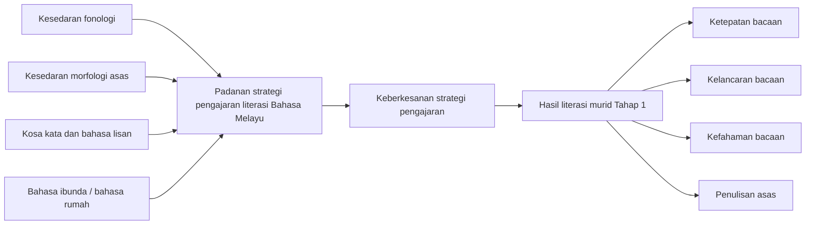
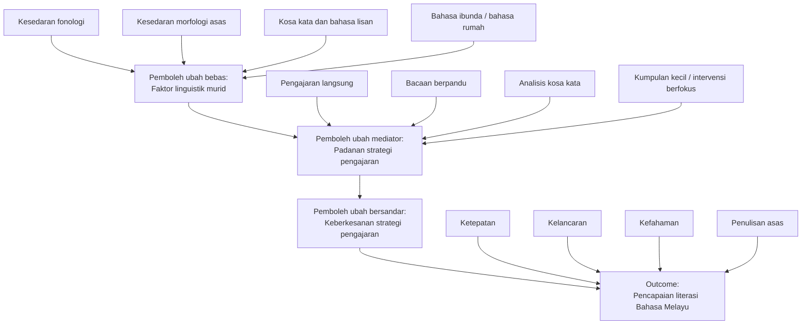

# Kerangka Kajian

## Kerangka konseptual utama

## Huraian ringkas

Kerangka ini menunjukkan bahawa faktor linguistik murid bertindak sebagai pemboleh ubah bebas yang mempengaruhi sejauh mana sesuatu strategi pengajaran dapat dipadankan dengan keperluan murid. Apabila padanan strategi itu tepat, keberkesanan pengajaran meningkat dan seterusnya membawa kepada hasil literasi yang lebih baik dalam kalangan murid Tahap 1.

## Komponen pemboleh ubah

### Pemboleh ubah bebas

- kesedaran fonologi
- kesedaran morfologi asas
- kosa kata dan bahasa lisan
- bahasa ibunda atau bahasa rumah

### Pemboleh ubah mediator / mekanisme pedagogi

- padanan strategi pengajaran literasi Bahasa Melayu dengan profil linguistik murid

### Pemboleh ubah bersandar

- keberkesanan strategi pengajaran literasi Bahasa Melayu

### Indikator hasil

- ketepatan bacaan
- kelancaran bacaan
- kefahaman bacaan
- penulisan asas

## Versi operasional untuk proposal

## Ayat penerangan yang boleh terus digunakan

Kerangka kajian ini berasaskan andaian bahawa faktor linguistik murid, iaitu kesedaran fonologi, kesedaran morfologi asas, kosa kata dan bahasa lisan, serta bahasa ibunda atau bahasa rumah, mempengaruhi keberkesanan strategi pengajaran literasi Bahasa Melayu. Hubungan ini dijelaskan melalui padanan strategi pengajaran dengan profil linguistik murid. Semakin tepat padanan antara strategi pengajaran dengan keperluan linguistik murid, semakin tinggi keberkesanan pengajaran, yang akhirnya dapat meningkatkan pencapaian literasi murid Tahap 1 dari aspek ketepatan bacaan, kelancaran bacaan, kefahaman bacaan dan penulisan asas.
