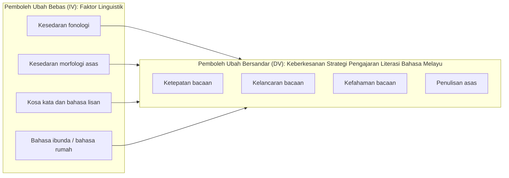
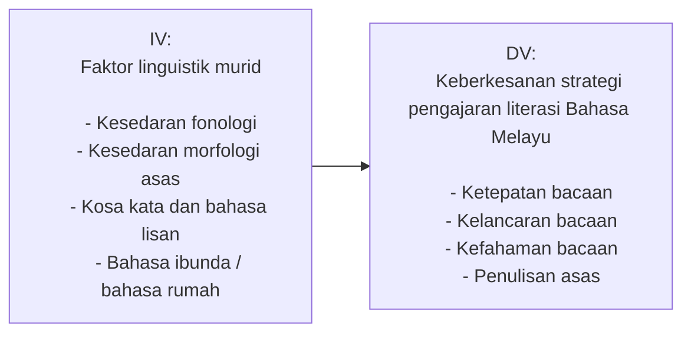

# Kerangka Kajian Mengikut IV dan DV

## Rajah utama

## Versi ringkas untuk proposal

## Huraian ringkas

Dalam kerangka ini, pemboleh ubah bebas ialah faktor linguistik murid yang terdiri daripada kesedaran fonologi, kesedaran morfologi asas, kosa kata dan bahasa lisan, serta bahasa ibunda atau bahasa rumah. Pemboleh ubah bersandar pula ialah keberkesanan strategi pengajaran literasi Bahasa Melayu yang diukur melalui ketepatan bacaan, kelancaran bacaan, kefahaman bacaan dan penulisan asas murid Tahap 1.

## Ayat yang boleh terus dimasukkan dalam proposal

Kerangka kajian ini menunjukkan bahawa faktor linguistik murid sebagai pemboleh ubah bebas dijangka mempunyai hubungan dengan keberkesanan strategi pengajaran literasi Bahasa Melayu sebagai pemboleh ubah bersandar. Faktor linguistik yang dikaji meliputi kesedaran fonologi, kesedaran morfologi asas, kosa kata dan bahasa lisan, serta bahasa ibunda atau bahasa rumah. Keberkesanan strategi pengajaran pula diukur melalui pencapaian murid dalam aspek ketepatan bacaan, kelancaran bacaan, kefahaman bacaan dan penulisan asas.
