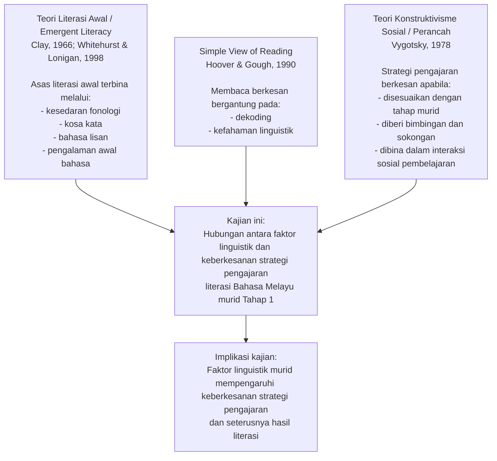
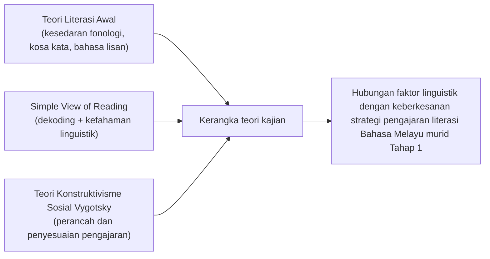

# Kerangka Teori

## Rajah utama

## Versi ringkas untuk proposal

## Huraian ringkas

Kerangka teori kajian ini dibina berasaskan tiga landasan utama. Pertama, Teori Literasi Awal menjelaskan bahawa kemahiran seperti kesedaran fonologi, kosa kata dan bahasa lisan merupakan asas kepada perkembangan membaca dan menulis pada peringkat awal persekolahan. Kedua, teori *Simple View of Reading* menjelaskan bahawa penguasaan bacaan bergantung pada gabungan keupayaan dekoding dan kefahaman linguistik. Ketiga, Teori Konstruktivisme Sosial Vygotsky menyokong keperluan strategi pengajaran yang disesuaikan dengan tahap perkembangan dan keperluan murid melalui bimbingan atau perancah.

Secara keseluruhan, ketiga-tiga teori ini menyokong hujah bahawa faktor linguistik murid perlu difahami terlebih dahulu supaya guru dapat memilih strategi pengajaran yang lebih sesuai, dan kesesuaian inilah yang akhirnya mempengaruhi keberkesanan pengajaran literasi Bahasa Melayu dalam kalangan murid Tahap 1.

## Ayat yang boleh terus dimasukkan dalam proposal

Kerangka teori kajian ini berasaskan Teori Literasi Awal, teori *Simple View of Reading*, dan Teori Konstruktivisme Sosial Vygotsky. Teori Literasi Awal menjelaskan bahawa kesedaran fonologi, kosa kata dan bahasa lisan merupakan asas perkembangan literasi awal. Teori *Simple View of Reading* pula menegaskan bahawa keupayaan membaca dipengaruhi oleh dekoding dan kefahaman linguistik. Sementara itu, Teori Konstruktivisme Sosial Vygotsky menyokong penggunaan strategi pengajaran yang disesuaikan dengan tahap perkembangan murid melalui perancah. Berdasarkan gabungan teori ini, kajian mencadangkan bahawa faktor linguistik murid mempunyai hubungan dengan keberkesanan strategi pengajaran literasi Bahasa Melayu murid Tahap 1.
