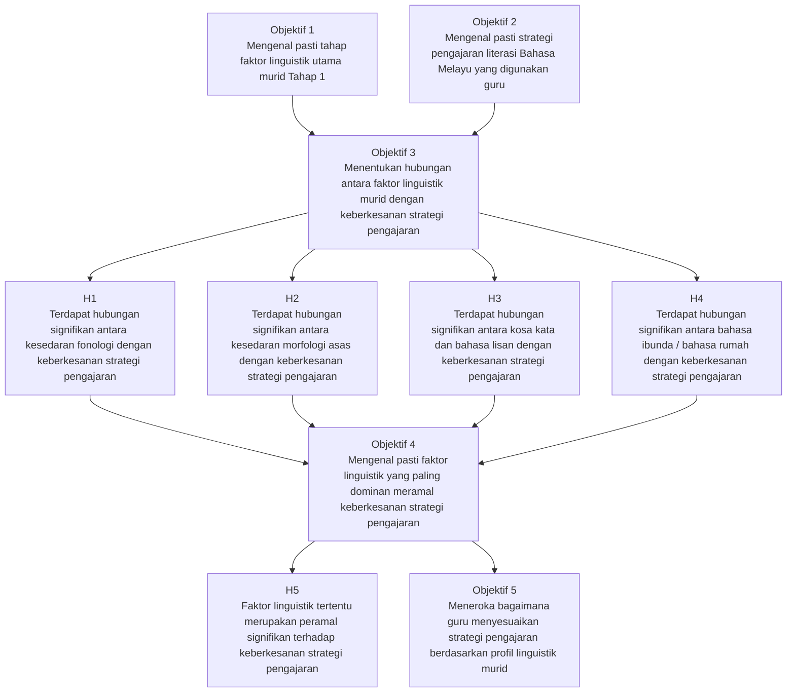
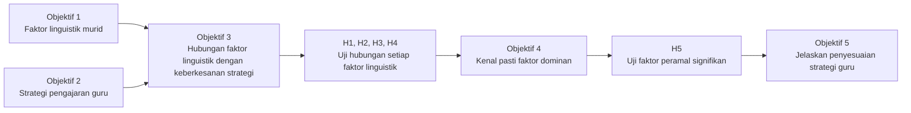

# Rangka Kajian: Kaitan antara Objektif Kajian dan Hipotesis Kajian

## Rajah utama

## Versi ringkas untuk proposal

## Huraian ringkas

Rangka kajian ini menunjukkan bahawa Objektif 1 dan Objektif 2 berfungsi sebagai asas deskriptif kajian, iaitu untuk mengenal pasti faktor linguistik murid dan strategi pengajaran guru. Kedua-dua objektif ini menyokong Objektif 3, iaitu untuk menentukan hubungan antara faktor linguistik dengan keberkesanan strategi pengajaran. Hubungan ini diuji melalui Hipotesis 1 hingga Hipotesis 4 mengikut setiap dimensi faktor linguistik.

Seterusnya, hasil pengujian Hipotesis 1 hingga Hipotesis 4 menjadi asas kepada Objektif 4, iaitu mengenal pasti faktor linguistik yang paling dominan meramal keberkesanan strategi pengajaran. Objektif ini diuji melalui Hipotesis 5. Akhir sekali, Objektif 5 melengkapkan dapatan kuantitatif dengan penerokaan kualitatif tentang bagaimana guru menyesuaikan strategi pengajaran mengikut profil linguistik murid.

## Rumusan kaitan objektif dan hipotesis

| Objektif Kajian | Hipotesis Berkaitan | Fungsi dalam kajian |
| --- | --- | --- |
| Objektif 1 | Tiada hipotesis langsung | Mengenal pasti profil faktor linguistik murid |
| Objektif 2 | Tiada hipotesis langsung | Mengenal pasti strategi pengajaran guru |
| Objektif 3 | H1, H2, H3, H4 | Menguji hubungan antara setiap faktor linguistik dengan keberkesanan strategi |
| Objektif 4 | H5 | Mengenal pasti faktor linguistik yang paling dominan sebagai peramal |
| Objektif 5 | Tiada hipotesis langsung | Menjelaskan dapatan secara kualitatif |

## Ayat yang boleh terus dimasukkan dalam proposal

Rangka kajian ini menunjukkan bahawa Objektif 1 dan Objektif 2 menyediakan asas deskriptif bagi mengenal pasti faktor linguistik murid dan strategi pengajaran guru. Objektif 3 pula menguji hubungan antara faktor linguistik dengan keberkesanan strategi pengajaran melalui Hipotesis 1 hingga Hipotesis 4. Seterusnya, Objektif 4 menguji faktor linguistik yang paling dominan meramal keberkesanan strategi pengajaran melalui Hipotesis 5. Akhir sekali, Objektif 5 melengkapkan analisis dengan meneroka bagaimana guru menyesuaikan strategi pengajaran berdasarkan profil linguistik murid.
